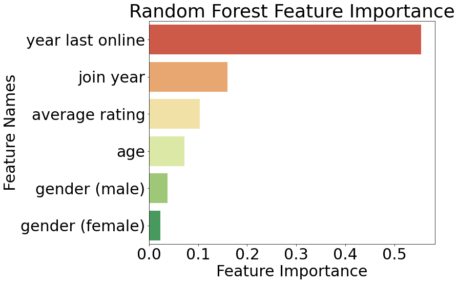
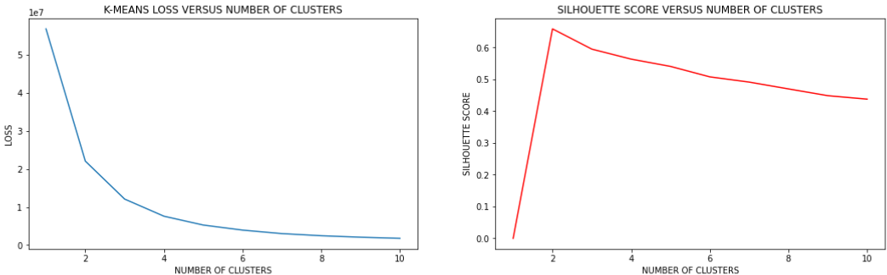
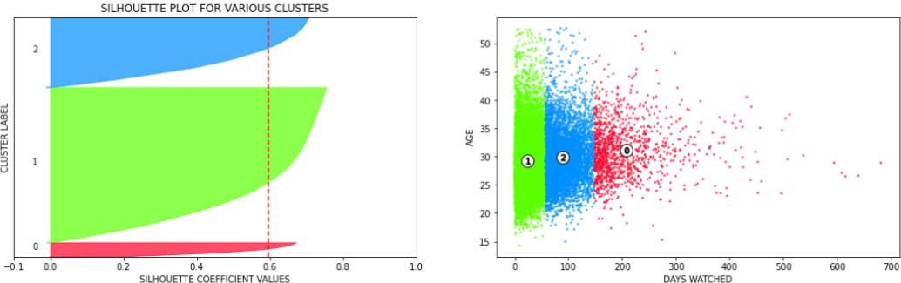
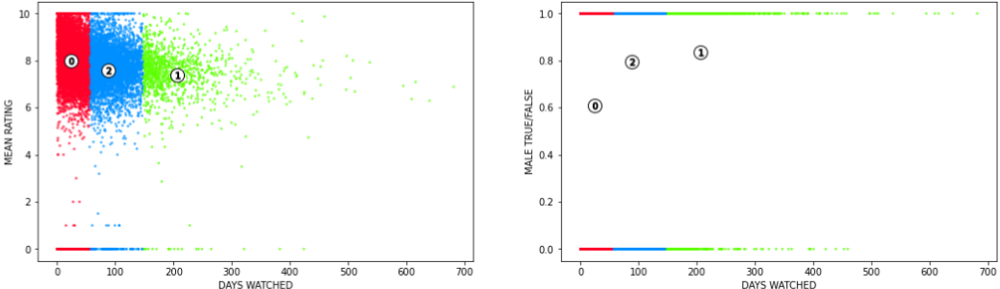
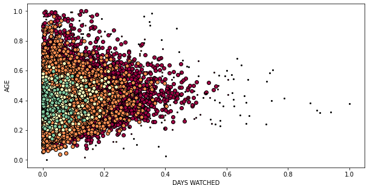
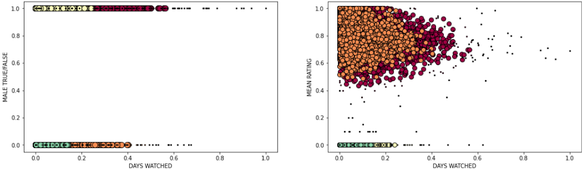
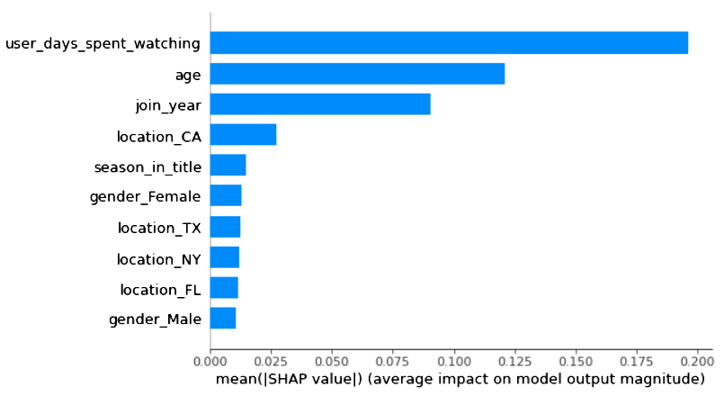
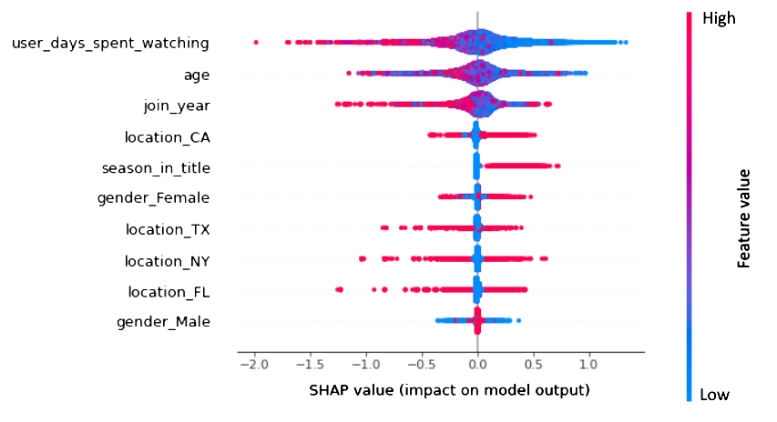
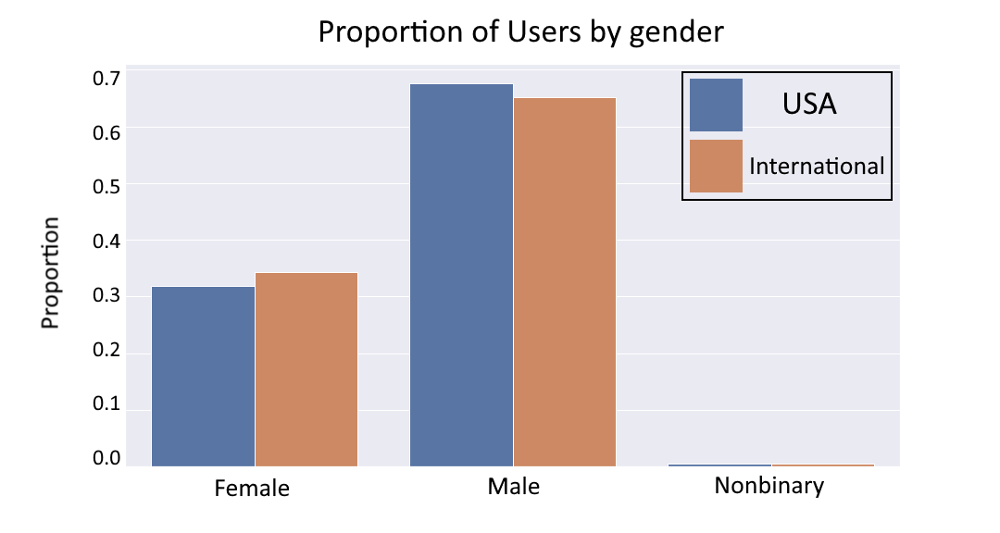

\begin{center} 
{\Large ORIE 4741 Project Final Report}

{\large Ben Rosenberg (bar94), Brennan O'Connor (bo92), Cooper McGuire (cjm424), Zach Katz (zdk4)}

{\large\today}
\end{center}

\vspace{1em}

\begin{center}\textbf{Abstract}\end{center}

> Anime can be described as animated, typically Japanese, TV shows and movies. Although once a small industry localized to Japan, anime has become more and more popular around the world over the past decade. In 2017, anime was nearly a $20 billion industry\footnote{https://www.cnn.com/style/article/japan-anime-global-identity-hnk-intl/index.html}. 

> As such, it is very important for anime studios and producers to understand their viewers. For our project, we aim to analyze viewing patterns of anime users based on their demographics. We use a dataset from MyAnimeList, a website similar to iMBD that allows users to track and rate the anime they’ve watched, and includes such features as gender, location, age, and total anime watchtime. 

> In our analysis, after performing \hyperlink{initial-regression}{initial regressions} using linear, lasso (with $\ell_1$ regularizer), and random forest methods, we determined that users who identified as male tended to watch more anime than users who identified as female or nonbinary. Furthermore, users who joined the platform earlier or were more critical tended to watch more anime than newer users or users who gave higher ratings on average.

> After performing the initial regressions, we turned to \hyperlink{clustering}{clustering} as a means of interpreting the data. Most relevantly, we found that the primary age range for users who watched the most anime was from 22 to 36 years, and (again) that users identifying as male tended to watch more anime on average.

> After clustering, we tried performing \hyperlink{predicting-anime-ratings}{additional regressions} on the dataset with respect to rating. To this end, we added 50 Bag of Words (BOW) features to the dataset, using the English titles of the anime. The most relevant and significant results of this were that users who spent more time watching anime tended to give it lower ratings, corroborating our results in the initial regression, and that having "season" in the title of an anime tended to result in higher overall ratings.  Lastly, interestingly contradicting our initial regression results, we found that users who joined the platform later tended to be more critical in their ratings.

> Finally, we discussed whether or not our analysis was a \hyperlink{wmd-and-fairness}{Weapon of Math Destruction} (WMD) and the potential fairness-related repercussions of our analysis. We determined that our model was *not* a WMD, due to its lack of severity with respect to the applications of it to society as a whole, the only protected demographic being gender and even that being shown to have minimal proportional difference across our dataset.

# Description of data sources

The data we're using in our project come from MyAnimeList.net, a site on which people can upload their lists of watched anime. MyAnimeList (henceforth referred to as MAL) is similar to [\color{blue}iMDB](https://www.imdb.com/): users can rate anime (1-10), leave reviews, and interact with other users in forums. In our analysis, we use a [\color{blue}Kaggle dataset](https://www.kaggle.com/azathoth42/myanimelist) composed of data scraped from MAL regarding users and the anime they've watched. 

## Descriptions of datasets

The Kaggle dataset is composed of several files, some of which are "cleaned" versions of others. A table of files and descriptions is as follows:

file|description
-|-
`AnimeList.csv`|raw list of anime on MAL
`UserAnimeList.csv`|collection of the individual anime that each user on the site has watched
`UserList.csv`|list of users on the MAL site
`anime_filtered.csv`|filtered version of `AnimeList.csv`
`anime_cleaned.csv`|cleaned version of `anime_filtered.csv`
`animelists_filtered.csv`|filtered version of `UserAnimeList.csv`
`animelists_cleaned.csv`|cleaned version of `animelists_filtered.csv`
`users_filtered.csv`|filtered version of `UserList.csv`
`users_cleaned.csv`|cleaned version of `users_filtered.csv`

The filtered versions of the files contain only those users with birth date, location, and gender filled. The cleaned versions of the filtered files have outliers removed (e.g., users with excessively large watch times), and nonsensical data removed (such as users with episode counts that exceed the episode count of a given anime). Of these files, we're going to be using the cleaned ones. The missing data that was removed in the cleaning process is not necessary in order to ensure that our analysis is done with sufficient rows; since we started with around 300,000 users, the paring-down of the usercount left us with enough data. 

## Location data transformation

Since we want to analyze user location as one of our features, we needed to parse the locations given to us by users. Unfortunately, MAL has no standardized way for users to input their locations; instead, users simply type in whatever they want. This led to our having to discard a large quantity of data due to poorly-defined locations.

Furthermore, we decided (for the sake of simplicity) to focus our analysis solely on the users whose location text implied that they were in the United States, with the goal of analyzing location on a state-by-state basis. To do this, we made several dictionaries of locations, and used these dictionaries to parse the location strings given by the users. We created a string-parsing function using these dictionaries and then applied it to the relevant dataframe columns. Once this was done, we were able to isolate the rows which had location data that was convertable to a US state, and put that data into a separate dataframe. Finally, we converted said dataframe back into a CSV to get the final version of the `users_cleaned.csv` dataset.

# Initial regression

The first question we sought to ask in our project is, "Can we predict how much anime someone has watched?" For this regression, we will only be using the `users_cleaned` dataset with the initial feature engineering described earlier. The dependent variable will be the number of days of anime a user has watched, and the features are listed below.

## Feature selection 

Here is a table of the covariates in the regression we'll be performing:

covariate | description
-|----
average rating | mean of the user's ratings of anime on their anime list
join year | year that the user created an account on MAL
age | age of the user, computed from user's date of birth
year last online | last year the user was online
gender (M, F, NB) | one-hot: user's gender (either male, female, or nonbinary)
location (state) | one-hot: user's location (2-letter abbreviation of the user's location (state) in the US)

We used these features because we think they will be useful for the regression. Age, gender, and location are demographics that we want to test, while average rating can be seen as a proxy for the critical nature of a viewer. Join year and year last online are best thought of in conjunction as a proxy for activity in the anime sphere. For example, someone who joined a long time ago but was online recently would be considered to be very active, while someone who has joined recently and is inactive would be considered to be very inactive.

Using all of these features will extract as much information as we can from our dataset, and will therefore help us to avoid underfitting. With this many features, overfitting is certainly a concern, but we will be using various techniques to avoid overfitting which we'll discuss in the next sections.

For starters, to evaluate each regression technique, we divided the dataset using an 80:20 train:test split.

## Linear regression

Our first approach was to use simple linear regression. Unfortunately, our model turned out to be rather unstable. The intercept was $2.08 \times 10^{12}$, and many of the coefficients were on the order of $10^{10}$. Additionally, we suspected that some of the features were collinear because of the large, unstable coefficients. We tried normalizing the features and removing extreme label outliers, but this did not improve the results. Note that we also tried normalizing and removing outliers on future regressions, but it didn't improve results, so we kept the original data.

## Lasso regression

In order to stabilize the model, we ran least squares regression with a Lasso ($\ell_1$) regularizer. In order to choose the regularization parameter $\lambda$ (which will avoid overfitting), we used 5-fold cross-validation and tested 100 possible values of $\lambda$ from 0.001 to 10. The optimal parameter, which we ended up using in the actual regression, was 0.101.

The advantage of the Lasso is that it chooses a model that is both stable and sparse. Here are tables showing the *nonzero* weights selected by the regression:

\begin{center}
\begin{multicols}{2}
\begin{flushright}
\begin{tabular}{l|r}
    coefficient & weight \\
    \hline
    average rating & -3.396 \\
    join year & -4.829 \\
    age & 0.735 \\
    year last online & 8.642 \\
    gender (\Female) & -3.622 
\end{tabular}
\end{flushright}

\begin{flushleft}
\begin{tabular}{l|r}
    coefficient & weight \\
    \hline
    gender (\Male) & 11.446 \\
    location (CA) & 3.994 \\
    location (NY) & 2.079 \\
    location (OH) & -2.536 \\
    location (TX) & 0.958
\end{tabular}
\end{flushleft}
\end{multicols}
\end{center}

These results indicate that men are more likely to have more days of anime views, and women are more likely to have fewer anime days. (The regression didn't have enough data points to infer viewership patterns about nonbinary users.) We also see that users who were recently online and users who joined earlier are more likely to have more anime days. Finally, users who had a *lower* average rating (and were more critical of anime in general) were more likely to have more anime hours. The one-hot locations that were selected did contribute to the model's predictive ability, but since these one-hots are inherently collinear, it is unfortunately difficult to make inferences about them.

Importantly, the model did not overfit; the training MSE was 2,238 and the testing MSE was 2,074. 
Because of scaling, the MSE's are difficult to interpret on their own. Instead, we can use the coefficient of determination $\mathcal{R}^2$ to analyze the effectiveness of this model. The coefficient of determination is a measurement of the proportion of variation in the dependent variable that can be measured by the covariates\footnote{\color{blue}https://en.wikipedia.org/wiki/Coefficient\_of\_determination}. The $\mathcal{R}^2$ for the training data was 0.255, and the $\mathcal{R}^2$ for the testing data was 0.257. 

Although these $\mathcal{R}^2$ values may seem low, viewership data is quite noisy, so we were satisfied with this result since our model does give a general sense of whether a given person is more likely to have watched more anime. This will be discussed more in the takeaways section.

## Random forest

In an attempt to improve the accuracy of our model, we decided to fit a random forest regressor on our training data. Random forest regressors have many hyperparameters to choose from, but of the most concern to us were the number of trees in the forest and the maximum depth of each tree. By default, sklearn's random forest implementation allows 100 trees per forest and unlimited depth of each tree! After an initial trial, these defaults led to massive overfitting. To fix this, we once again ran a 5-fold randomized CV (with 100 iterations) to choose possible parameter values between 1-50 for the number of trees, and 1-10 for the maximum depth of each tree. The optimal parameters chosen were 40 estimators with a max depth of 6. Figure 2 below shows the top 6 feature importances from this regression. These are relatively in line with the features chosen by the Lasso regression.

{width=350px}

The training MSE was 1,984 and the testing MSE was 1,967. This small difference indicates that we chose parameters wisely to avoid overfitting. 

The training $\mathcal{R}^2$ was 0.339, and the testing $\mathcal{R}^2$ was 0.296. 
Therefore, the random forest model was able to provide slightly better predictive power than the lasso regression, as evidenced by slightly lower MSE scores, and more importantly, the higher coefficients of determination. 

## Regression takeaways

Although we couldn't construct any perfect models, both the ridge regression and random forest models provide useful insight into anime viewership. If we needed to predict the number of days someone has watched anime, the random forest model is more useful since it has a higher $\mathcal{R}^2$ and lower MSE's. However, for the purposes of inference, we would turn to the Lasso regression, since we know it only chose the *most important* features. One example of such an inference would be observing that if we had a male who tended to rate anime poorly, we would expect him to have watched a substantial quantity of anime. This type of inference could be useful for an anime studio targeting an audience for a new program.

# Clustering

Second, we asked "Are there distinct clusters of anime-watchers?" Through demographic and usage data tied to every user, we aimed to implement a form of $k$-means clustering to partition the user set. This would inform anime studios of stereotypical user profiles from which to infer preferences. Clustering would also provide insight into “lookalike” audiences for the company’s user base, giving marketing management concrete audiences to prioritize. Clustering may also facilitate more effective budget allocations for marketing and acquisition of anime streaming/broadcasting rights.

covariates | description
-|----
days spent watching | number of days (again, not hours or minutes, days) the user has spent watching anime
age | age of the user, computed from user's date of birth
average rating | mean of the user's ratings of anime on their anime list
male | one-hot: user's gender is declared male

Using the full dataset, we sought covariates that ecompassed both past and present users of MyAnimeList. Multiple models were generated using location and join year but negligible or no improvements in clustering were seen. Further, the specific genre interests of users proved far too difficult to extract in the scope of this project but likely would have proved important. For interpretability and simplicity, these four covariates were chosen. 

One main question associated with the $k$-means algorithm is the input $k$, the number of clusters. In a dataset with which no known cluster structure exists, we fist had to utilize metric tests to find such input $k$. The most common test is the "elbow test" in which an economical number of clusters is chosen where diminishing returns on the $k$-means loss function begins. As the number of clusters increases, the loss will always decreases so a point is found where adding another cluster doesn't improve modeling. This graph is shown below in blue. There are a few different candidates for optimal so an additional metric test was used. The average silhouette score of a clustering reflects the cohesion between points in a cluster and seperation between clusters. Each point in the graph is assigned such a score ranging from -1 to +1. The higher the score, the better the clusters describe the data. An average is computed across all points as the model's silhouette score. This is graphed below in red. For context, a score of 0.75 is practically exceptional in datasets of this size. 

{width=85%}

Although silhouette scores provide a quantitative reasoning to choosing an input $k$, they are not absolutes; in fact, there is an art form to such decision-making. In our modeling, with two clusters, the two centroids differed only in days spent watching, providing little to conclude from with regard to market segmentation. So, we chose to move to three clusters in order to extract an additional differentiation attribute. In this case, that proved to be the binary true/false on the male gender. Below are clustering plots. Keep in mind the multidimensionality of the dataset and clusters.   

{width=75%}

{width=75%}

Above, we found three distinct clusters with the most impactful separating covariate being days spent watching. A silhouette plot for points in each cluster shows the varying cohesion of classified points with the average demarcated. A desired silhouette score plot for points would show steep inclines at high scores and minimize the shallow inclines that result from distant points to centroids. As shown, those who watch the greatest amount of anime tend to be between the ages of 22 and 36 whereas the low volume users tend to range more greatly from 17 to 50 years of age. Next, those leading the pack in viewing also tend to be more critical, likely due to the law of large numbers. Lastly, the quasi-gender plot's centroids show that the least male cluster also consumes the least anime, with the most male consuming the greatest number of days watched.

Although the above clustering was far better than expected for a dataset of this size, we still sought to improve the modeling by excluding noisy points that were furthest from centroids. In an audience of 19,000 U.S. users, there will always be outliers and from a marketing perspective it is not necessary to include them in explaining the vast majority of the audience. To rectify this, we turned to an alternative clustering method called DBSCAN (Density-Based Spatial Clustering of Applications with Noise). DBSCAN is more flexible in its clustering shapes by growing clusters from spatially dense areas and expanding them. DBSCAN also determines its own estimate of the number of clusters through internal silhouette scoring. Again, in need not classify every point as a cluster member. DBSCAN also utilizes min-max scaled covariates. Below is our model with four clusters, 103 points classified as noise (black), and a silhouette score of 0.731. 

{width=35%}
{width=60%}
\begin{figure}[!h]
\caption{4-cluster model}
\end{figure}

In contrast to $k$-means, here we see heavier reliance on the quasi-gender covariate. There are essentially high and low anime consumption clusters for both encoding options. This model leads to the conclusion that users who watch less also tend to rate zeroes, possibly contributing to not watching more or another concealed reason. Likely due to the DBSCAN algorithm seeing a dense area at rating zero, clustering seemingly treats low raters as very similar but it is unclear why so many users do so.  Lastly, those who watch the least anime and do not declare themselves as male tend to be the least varying in age. 

# Predicting anime ratings
The next question we wanted to answer was, "Can we predict anime ratings?" To answer this question, we created a new dataset in which each entry represented a single user's rating for a particular anime. We wanted to include demographic covariates from our initial regression, so this dataset was generated using by of `users_cleaned` (US-only) and `animelists_cleaned` on the primary key anime username.

We note that this is technically a multi-class classification problem, since each user can rate an anime $1,2,...,10$. However, we still use a regression here since we care more about predicting whether an anime is *highly rated* than we do about predicting the exact rating.

## Feature selection
Shown below is a table of the features used in our regression. Since each row is a user and an anime they watched, the goal is to predict how a user will rate a given anime.

covariate | description
-|----
days spent watching | number of *days* (again, not hours or minutes, *days*) the user has spent of their life watching anime 
age | age of the user, computed from user's date of birth
join year | year that the user created an account on MAL
gender (M, F, NB) | one-hot: user's gender (either male, female, or nonbinary)
location (state) | one-hot: user's location (2-letter abbreviation of the user's location (state) in the US)
word in title (English) | many-hot: whether a given word was found to be in the English version of the anime's title

In order to create the [bag-of-words model](https://en.wikipedia.org/wiki/Bag-of-words_model) to represent anime titles, we took the top-50 most common words among the anime in `animelists_cleaned` and then generated a many-hot encoding for them. We removed common words like "the" and "a" from the analysis, and we treated plural and singular versions of the same word as one entry in the encoding.

## Histogram-based gradient boosting
Since the dataset includes every anime each user has watched, it is extremely large--around 2.5 million rows. Since we wanted a model that was both fast and accurate, we selected [histogram-based gradient boosting regression](https://scikit-learn.org/stable/modules/generated/sklearn.ensemble.HistGradientBoostingRegressor.html#sklearn.ensemble.HistGradientBoostingRegressor). This method is very similar to the typical gradient-boosted ensemble, except that it [groups features together into a certain number of "bins,"](https://towardsdatascience.com/an-overview-of-boosting-methods-catboost-xgboost-adaboost-lightboost-histogram-based-gradient-407447633ac1) instead of treating them as continuously-distributed. This [dramatically speeds up runtime](https://machinelearningmastery.com/histogram-based-gradient-boosting-ensembles/).

## Cross-validation for hyperparameter tuning
As in our initial regression, we used a randomized grid-search with 25 iterations for hyperparameter tuning. Ultimately, cross-validation selected a `max_depth` of 53, `learning_rate` of 0.5, and `max_bins` of 100 (this represents how many bins the algorithm can make when it groups features together).

## Feature Importance (SHAP)
Since the histogram-based gradient boosting regressor did not have a feature importance attribute, we decided to use SHAP (Shapley Additive Explanations) values instead. SHAP values use a game theory approach to tell us how much each feature contributes to the prediction\footnote{https://christophm.github.io/interpretable-ml-book/shap.html\#shap}\footnote{https://towardsdatascience.com/a-novel-approach-to-feature-importance-shapley-additive-explanations-d18af30fc21b}. Since SHAP can be slow on very large datasets, we used the first 100,000 entries of the training set for this analysis, but that is more than enough data to get a sense of feature importance.

{width=50%}
{width=50%}
\begin{figure}[!h]
\caption{Left: Feature importance; Right: Summary}
\end{figure}

The figure on the left shows the top 10 mean SHAP values, which tell us how important each feature is to the model's predictions. The figure on the right is much more interesting. Each point on the plot is an actual training observation. A negative SHAP value indicates that the feature reduced the predicted rating, and a positive SHAP value indicates that the feature increased the prediction rating. The "Feature Value" gradient tells us how large or small the actual feature was. 

As an example, we see that when users have spent many *days* watching anime, they are more likely to rate any given anime with a lower score, which makes sense since they are probably much more critical of anime in general. We see a similar trend with `age`, although there is a bit more noise there. Interestingly, with `join_year`, we see that a later `join_year` actually predicts a lower rating. This might seem contradicatory, but it is not because `join_year` is substantially different from days spent watching. There are many MAL users who recently joined but still logged all of the anime they had watched in the past on their new account. 

Moving along, since there are many red points on both sides of the SHAP plot for California, we can't conclude how that feature alone impacts the model; it is still an important feature, but its importance might be derived from interactions with other features. This is also the case for gender attributes. Finally, we note that having "season" in the title implies a higher predicted rating. This is completely reasonable, since the anime which are renewed for more seasons (and advertise this fact in their titles) tend to be excellent shows.

## Results and discussion
We evaluated our model using a 75:25 train:test split. We achieved a training MSE of 2.33 and a testing MSE of 2.34, indicating that the model did not overfit. The training $\mathcal R^2$ was 0.146 and the testing $\mathcal R^2$ was 0.142. Although the $\mathcal R^2$ values may seem low, it is actually quite good considering the use of the model. If we use the model to make several anime recommendations, it is very likely that the viewer will enjoy at least one of our suggestions. That is, the goal of the model is to predict whether a user will, in the most general terms, enjoy a given anime. Therefore, even if we cannot predict the exact rating, the model will likely be very good at generating recommendations.

# WMD and Fairness

## Is our analysis a Weapon of Math Destruction?

In terms of the demographic questions we tackled, such as predicting how much anime someone has watched or determining demographic clusters of anime viewers, our model is not a WMD. The outcome is easily measurable since the website can keep track of the amount of time a given user spends watching anime. Furthermore, since we intend to perhaps use the results of our model for marketing or in-app recommendation purposes, the corresponding 'negative' consequences would be fewer advertisements or different recommendations to a certain demographic group. However, given the nature of our problem, even if one group or type of anime is systemically underrepresented in the recommendations made by our model, the repercussions are not incredibly severe (relative to those in college admissions, credit card applications, mortgage applications) as that group would merely be less inclined to watch anime. 

With regards to predicting the quality of a given anime, again, our model is not a WMD. The outcome is easily measurable since the website can keep track of the ratings given to each show. Furthermore, since we intend to perhaps use the results of our model for recommendation purposes, the corresponding 'negative' consequences would be fewer recommendations for a certain type of show. However, even if certain types of anime were systematically underrepresented in the in-app recommendations, a self-fulfilling feedback loop is not necessarily created because users can still stumble on these shows independently or hear about them through word of mouth or social media which are likely stronger influences anyway. 

## Fairness

When it comes to fairness, the only protected attribute that we had access to was gender. In fact, an individual's gender was one of our top five most important attributes for predicting how much anime a given individual views, so it is certainly worth investigating our algorithmic fairness with respect to this characteristic. However, given that our problems were not classifications, the metrics from class are not directly applicable, so we shall investigate fairness differently. 

In our clustering problem, we could look at the counterfactual fairness of our clusters as this is the only relevant metric. We see that flipping one's gender does not change our clusters at all. Intuitively, this makes sense, but due to the clustering nature of our problem, counterfactual fairness is not remarkably applicable when compared to its usage in classification problems. 

Furthermore, we considered looking into the unawareness metric with respect to our algorithm's predictions. However, since our focus is on curating predictions for a given user, we prefer more accurate recommendations at the expense of unawareness of a protected trait. With regards to one's recommendations, using one's gender is not a discriminatory process, but rather one to ensure more accurate and enjoyable predictions for our users, and utilizing the information encapsulated in one's gender is substantially more beneficial than harmful in such a context.  

When predicting a given user's watchtime, we saw that one's gender was one of our five most important traits for prediction. At first, we hypothesized that perhaps fewer females watch anime within the United States (when compared to the world's population), and thus that when we extrapolate our algorithm worldwide, we may misrepresent the importance of one's gender. If this was the case, perhaps in the United States our algorithm learns to minimize the importance of being female in its since they make up an insignificant proportion of the population. However, when we investigated our dataset in full, we saw that this was not the case. 

{width=50%}

Surprisingly, in fact, we can see that the proportions were almost identical. Thus, if we used our model to then make predictions on the worldwide portion of our dataset, we could be reasonably confident that we will be fair with respect to gender. 

Given the nature of our problem, both in its severity relative to other fields (parole, college admissions, etc.) and form (regression and clustering vs. classification), fairness with respect to gender is not as important or measurable as it would be in other contexts. However, given the above evidence, we are reasonably confident that our predictions are not discriminating against or misrepresenting an individual based on their gender. With that said, given the limitations of our analysis, it is still important to be mindful of this protected attribute because perhaps in real life there is a more equal split between male and female viewers, and in that case, our algorithms may not act as fairly as they should. 

# Conclusion

Over all our analysis, we determined a couple of mainly significant things:

 - Users who watch more anime rate it more critically (initial regression, rating prediction)
 - The main age range for anime-watchers is 22 to 36 years (clustering)
 - Anime with more initial success tend to do well in future seasons (bag of words -- rating prediction)
 - Users who identified as male tend to watch more anime than users who identified as female or nonbinary (initial regression, clustering)

This information could be very important to any anime studio deciding which show to produce, or to anime distributors deciding which groups to target their advertising campaigns to for upcoming titles, or even for corporations like Netflix and Crunchyroll deciding which anime to purchase from distributors. The age range and gender demographics are the most useful as they can be directly translated into advertising 

