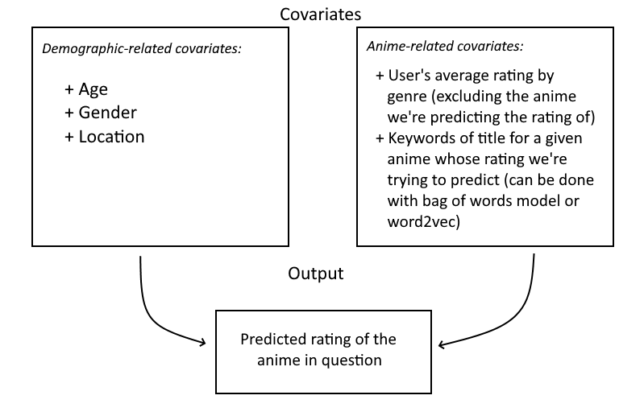

# Description of dataset/background

Anime can be described as predominantly Japanese TV shows and movies. Although once a small industry localized to Japan, anime has become more and more popular around the world over the past decade. In 2017, anime was nearly a $20 billion industry\footnote{https://www.cnn.com/style/article/japan-anime-global-identity-hnk-intl/index.html}. 

As such, it is very important for anime studios and producers to understand their viewers. For our project, we aim to analyze viewing patterns of anime users based on their demographics. We will use a dataset from MyAnimeList, a website similar to iMBD that allows users to track and rate the anime they’ve watched. More specifically, the dataset includes gender, location, age, and the date joined for each user on MyAnimeList (as of mid-2018). Additionally, we have a list of every anime each user has watched and the rating they gave that anime. We also have total anime watchtime for each user. Finally, we have information about each anime, such as the title, genres, studio, and more.

# Project questions

## Are there distinct clusters of anime-watchers?
Through demographic and usage data tied to every user, we aim to implement a form of $k$-means clustering to partition the user set. This will inform anime studios of stereotypical user profiles from which to infer preferences. Clustering will also provide insight into “lookalike” audiences for the company’s own user base, giving marketing management directives concrete audiences to prioritize. Clustering may also facilitate more effective budget allocations for marketing and acquisition of anime production rights.

## Can we effectively predict the total watchtime of a given user?
One of the features we have in our dataset is total watchtime, measured in days. This might be skewed based on users' join date and ages, so it's possible that we'll want to normalize our data based on those features. Watchtime is an easy way to get an idea of the prevalence of certain demographics in the watcher-base as a whole, and will be the first feature studios turn to when determining what their target audience looks like.

For this prediction, we will use the demographic covariates in our dataset. Additionally, we may use features such as average rating to see if they impact user watchtime.

## Can we effectively predict the favorite genre/genres of a given user?
Each anime is categorized into various genres, and since we have the list of all anime a given user has watched, we can determine what types of genres a given user prefers. From a management standpoint, this could help to inform an anime recommendation system that suggests certain genres or shows to certain users, and thus increases one’s interest and likely retention on a given site (e.g., CrunchyRoll, Netflix). Furthermore, companies that create anime or provide subtitles would know which types of shows to develop or work on, based on their target audience.  We will also use demographic covariates and rating information in this prediction.

## Can we effectively predict the rating of a given anime by a given user?
For this section of the project, we envision the following supervised learning problem (this problem is a bit more complicated, so we present the information in a diagram):

{width=350px}

The function (e.g., the weights of a linear regression model) that we find to predict users’ ratings will be extremely useful for any anime studio. If they are trying to target a specific demographic, for example, they can see if the anime in question will be highly rated by that group. More broadly, since we are including title as a feature in the model, a studio can experiment with different potential titles for an anime and see how the ratings vary.
